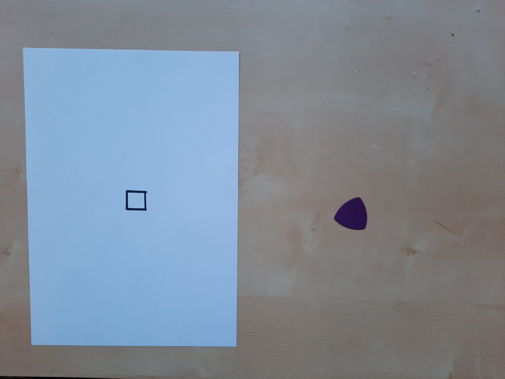
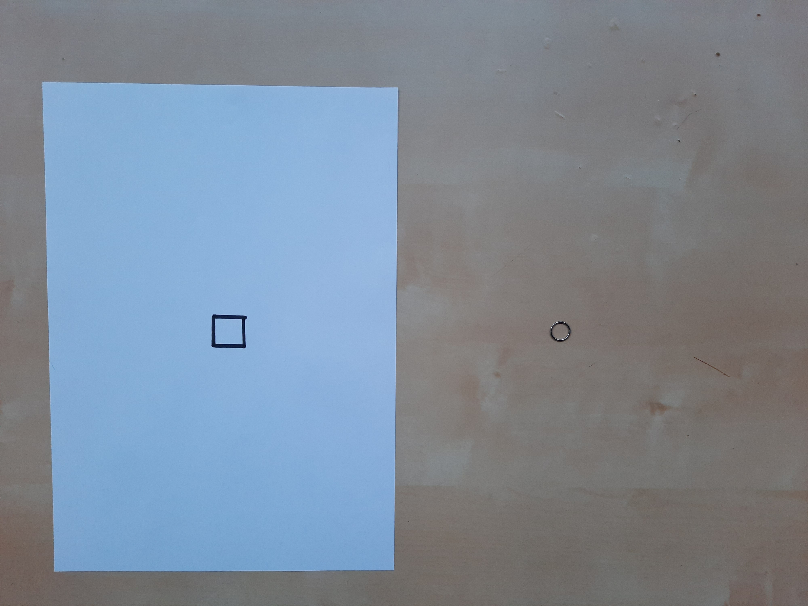
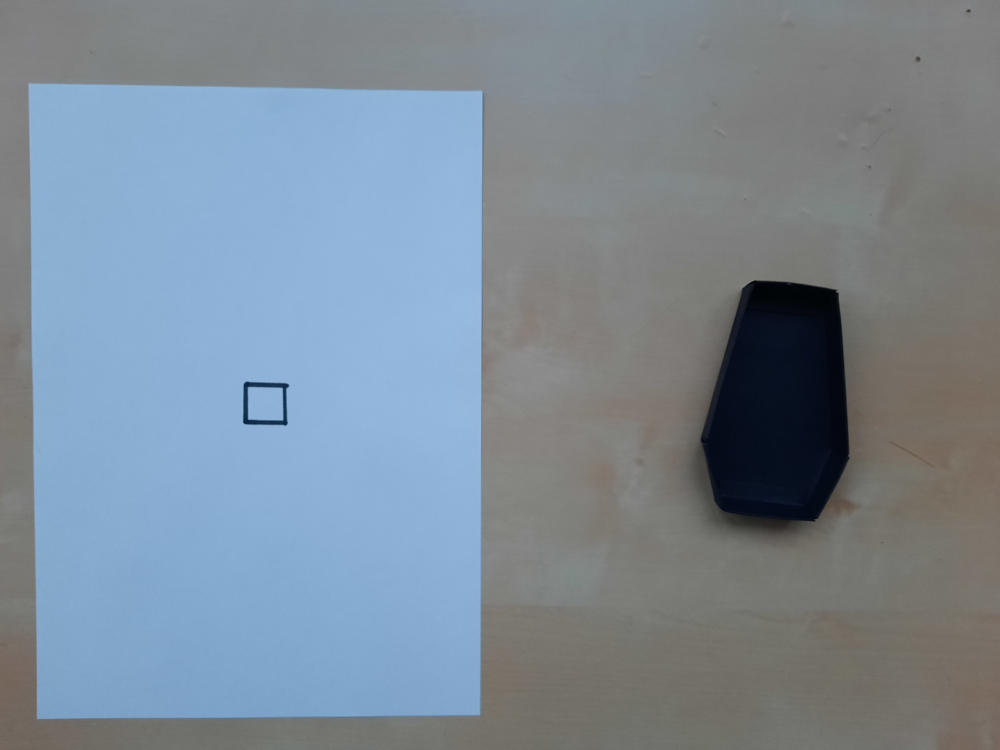
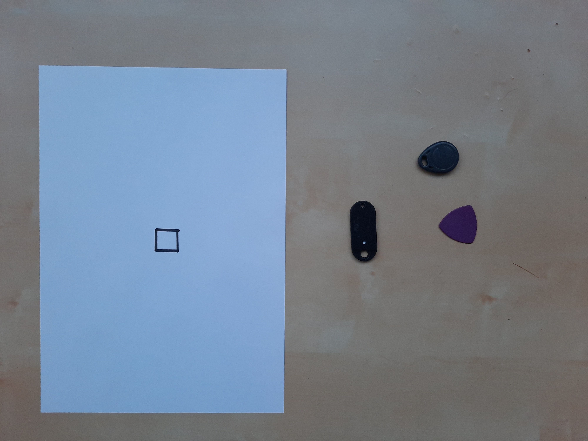
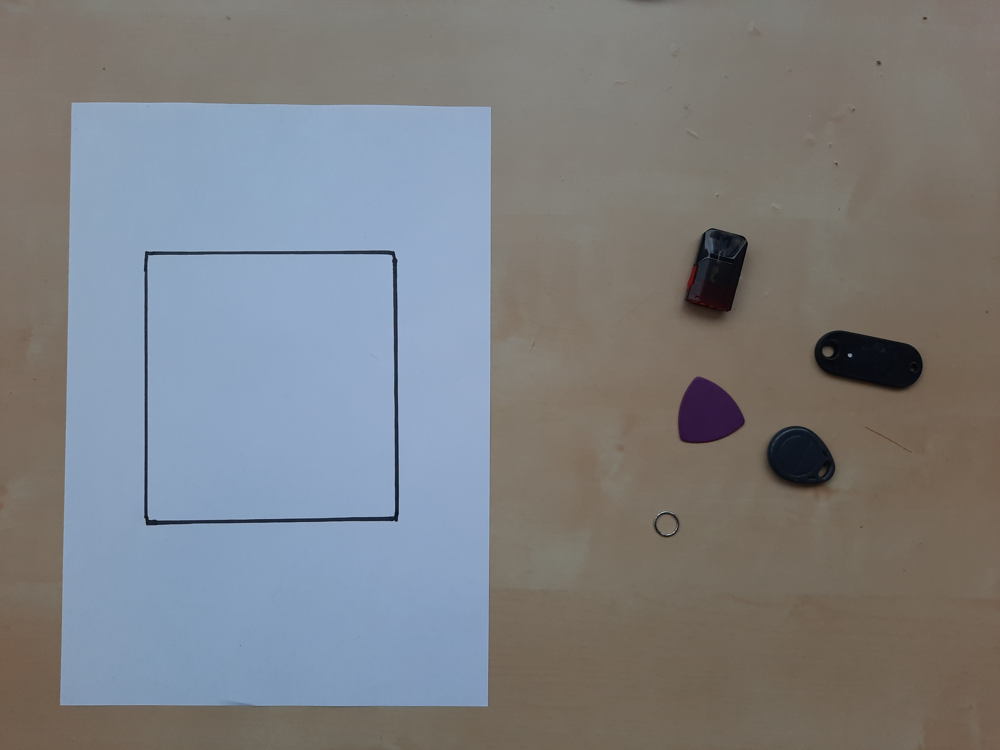

# Intelligent-placer: тестовые данные

## Малый многоугольник

1.1) Малый многоугольник и малый объект, который не поместится. Ответ: **False**

1.2) Малый многоугольник и малый объект, который поместится. Ответ: **True**

1.3) Малый многоугольник и большой объект. Ответ: **False**

1.4) Малый многоугольник и множество малых объектов. Ответ: **False**

## Большой многоугольник

2.1) Большой многоугольник и малый объект. Ответ: **True**

2.2) Большой многоугольник и множество малых объектов. Ответ: **True**

2.3) Большой многоугольник и большой объект. Ответ: **True**

2.4) Большой многоугольник и множество больших объектов, которые поместятся. Ответ: **True**

2.5) Большой многоугольник и множество больших объектов, которые не поместятся. Ответ: **False**

